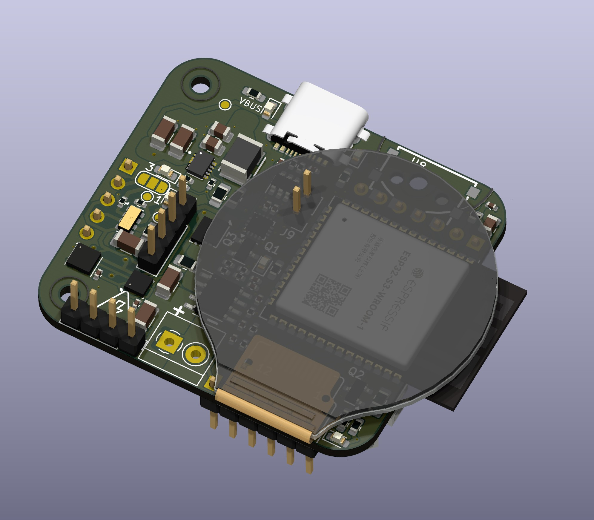

# PowerPod: The Ultimate USB-C Power Delivery Analyzer & Power Supply

**PowerPod** is an innovative and versatile ESP32-powered USB-C Power Delivery (UCPD) compatible device designed to enhance the development and debugging process for projects and prototypes. This compact and sleek power supply and analyzer can be seamlessly integrated inline with existing setups, providing invaluable insights and control over power delivery.

With PowerPod, developers can easily monitor and manipulate voltage levels, log data, and analyze power consumption, all through a convenient and intuitive interface on their smartphones. The device is equipped with both WiFi and BLE connectivity, enabling wireless control and logging, eliminating the need for clunky physical buttons and allowing for remote operation from a distance.

The sleek design of PowerPod ensures it can be effortlessly attached to any existing UCPD compatible wall wart or power source, without requiring additional stands or tables. Its compact form factor guarantees flexibility and convenience, making voltage control and data logging accessible and hassle-free.

## Features:

- **USB-C Power Delivery Compatibility**: PowerPod is fully compatible with USB-C Power Delivery, ensuring compatibility with a myriad of devices and applications.
  
- **Wireless Control and Logging**: Say goodbye to physical buttons. With built-in WiFi and BLE, control and log data wirelessly using your smartphone.
  
- **Adjustable Voltage Output**: Precisely control voltage levels to suit your project's needs. Switchable to 5V, 9V, 15V, and 20V, 
   
- **Compact and Sleek Design**: Integrate PowerPod effortlessly with your existing setups without the need for additional equipment.
  
- **Inline Integration**: Enhance convenience by integrating PowerPod inline with UCPD compatible power sources.

- **IO Breakout**: Incorporate higher voltage into your existing projects with ease. PowerPod features a separate 3.3V power domain.

- **Power Analyzer Capability**: Measure your project's current draw with precision. Understand your power needs and optimize accordingly.

- **Software Safety Cut-off**: No more worries about excessive current draw. PowerPod's current sensing capability ensures the output FET is switched off during high current scenarios, safeguarding your equipment.

- **Output FET**: Toggle high voltage output on and off with the integrated output FET, providing you with more control over your power delivery.

- **Open Source Development**: Customize and expand PowerPod's capabilities with its open-source nature. Dive deep into its functionalities and tailor it to your specific needs.

## Specifications:

- **Microcontroller**: ESP32-C3
- **WiFi**: 802.11b/g/n
- **Bluetooth**: BLE 4.2
- **FLASH**: 4MB
- **Programming**: Integrated JTAG Controller
- **UCPD**: FUSB302MPX
- **Output**: CC6904SO-10A | Current Sense: Hall Effect Current Sensor
- **Output Enable**: DMP3017SFG-7 | FET
- **Power**: TPS62175DQCT | 500mA 3.3V SMPS

## Why Choose PowerPod?

- **Advanced Power Delivery**: PowerPod is not just another power supply. It's a state-of-the-art USB-C Power Delivery solution tailored for developers, hobbyists, and professionals alike.

- **Seamless Integration**: Its compact design and inline integration capability mean you can effortlessly incorporate PowerPod into any setup, be it a professional lab or a hobbyist's workbench.

- **Wireless Convenience**: Gone are the days of being tethered by wires. With PowerPod's WiFi and BLE capabilities, you can monitor and control your power delivery from anywhere in the room.

- **Safety First**: With features like software safety cut-off and accurate current measurement, PowerPod ensures that your devices are protected from potential overcurrent scenarios.

- **Open Source Flexibility**: PowerPod believes in the power of community. All our designs and software are open source. Dive into our [GitHub repo](https://your-github-link-here.com) for detailed documentation.

- **IO Breakout for Versatility**: PowerPod's IO Breakout feature allows you to incorporate higher voltage into your projects, giving you more flexibility and expanding the range of projects you can work on.

- **Cost-effective**: With all its advanced features and capabilities, PowerPod offers unparalleled value for money. Why invest in multiple devices when PowerPod can do it all?

PowerPod is not just a tool; it's a game-changer. Whether you're developing, debugging, or optimizing, PowerPod ensures you do it efficiently, safely,

## Package Contents:

- 1x PowerPod
- Additional components (Specify as per your package)

## Manufacturing & Logistics:

Our designs have undergone rigorous testing and verification. We've already produced a pilot batch, and our manufacturing partners are geared up for full-scale production. All PowerPod units will be shipped globally, ensuring timely delivery to our backers.

## Comparison: PowerPod vs PD Micro vs Lab Power Supply

| Feature/Specification | **PowerPod** | **PD Micro** | **Lab Power Supply** |
|-----------------------|--------------|--------------|----------------------|
| **Microcontroller**   | ESP32-C3     | ATmega32U4   | N/A                  |
| **WiFi**              | 802.11b/g/n  | No           | No                   |
| **Bluetooth**         | BLE 4.2      | No           | No                   |
| **FLASH Memory**      | 4MB          | N/A          | N/A                  |
| **USB-C PD**          | Yes          | Yes          | No                   |
| **Output Control**    | Adjustable   | Adjustable   | Fully Adjustable     |
| **Wireless Control**  | Yes          | No           | No                   |
| **Smartphone App**    | Yes          | No           | No                   |
| **Current Measurement**| Accurate    | Basic        | Highly Accurate      |
| **Design**            | Compact & Sleek | Compact  | Bulky                |
| **Open Source**       | Yes          | Yes          | Varies               |
| **Programming Interface** | Integrated JTAG | Arduino IDE | N/A              |
| **Inline Integration**| Yes          | No           | No                   |
| **Price**             | $49 | $28 | >$199 |

